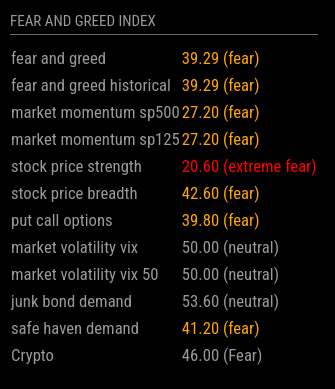

# MMM-FearAndGreedIndex-dv

The `MMM-FearAndGreedIndex-dv` is a module for MagicMirror² that displays the Fear and Greed Index for both traditional markets and cryptocurrency markets. This index is a measure of market sentiment, with lower values indicating fear and higher values indicating greed.

This fork of the original [MMM-FearAndGreedIndex](https://github.com/Pip1405/MMM-FearAndGreedIndex)
- replaces the Python script `fearandgreed.py` with Node.js `fetch()`
- caches the results of both data sources
- applies color scheme in line with CoinMarketCap's color scheme




## Installation

Navigate to your MagicMirror's `modules` folder and execute the following commands:

```bash
cd ~/MagicMirror/modules
git clone https://github.com/devio-at/MMM-FearAndGreedIndex-dv.git
```

## Configuration
To configure the module, you need to add the following configuration block to the modules array in the config/config.js file:
```bash
{
    module: "MMM-FearAndGreedIndex-dv",
    position: "top_left", // This can be any of the regions, adjust to your liking.
    config: {
        updateInterval: 3600000,     // Update every hour, adjust as needed.
        fearandgreedHeaders: { }    // custom HTTP headers
    }
},
```


## Usage
The module will display two indices:

Traditional Fear and Greed Index: Represents the sentiment in traditional markets.
Crypto Fear and Greed Index: Represents the sentiment in cryptocurrency markets.
The index values are color-coded:

<span style="color:red">Red</span>: Indicates extreme fear (value <= 25)<br />
<span style="color:orange">Orange</span>: Indicates fear (value <= 45)<br />
<span style="color:#999">Grey</span>: Indicates neutral<br />
<span style="color:yellow">Yellow</span>: Indicates greed (value >= 55)<br />
<span style="color:green">Green</span>: Indicates extreme greed (value >= 75)<br />


## Troubleshooting
If you encounter any issues with the module, first check the logs for any error messages:
pm2 logs mm
If you cannot resolve the issue, please open an issue on the GitHub repository with a detailed description of the problem and any relevant logs.

## Contributing
If you have suggestions for improvements or enhancements, feel free to fork the repository and submit a pull request with your changes.

## License
The MMM-FearAndGreedIndex-dv module is released under the MIT License. For more details, please see the LICENSE file in the repository.

This `README.md` provides a comprehensive guide for users to get started with your module, including how to install, configure, and use it, along with update and troubleshooting instructions.


